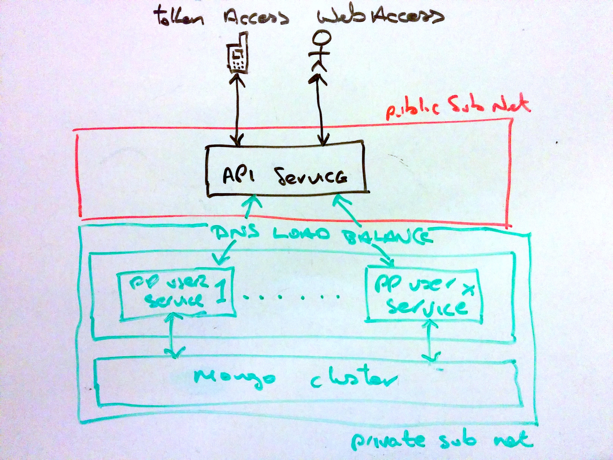

Project Templates
=================

.. contents::

Introduction
------------

Project layout templates for various types of python projects using on the Open
Source PythonPro librarys for speedy development bootstrapping. This uses the
MrBob project behing the scenes.

 * http://mrbob.readthedocs.org/en/latest/

Set up
------

You can pip install the latest code version::

  pip install http://github.com/pythonpro/project-templates/tarball/master#egg=project-templates

Core Package
------------

This template creates namespaced packages from the project.templates.corepkg
template::

    mrbob project.templates:corepkg

    Welcome to mr.bob interactive mode. Before we generate directory structure, some questions need to be answered.

    Answer with a question mark to display help.
    Values in square brackets at the end of the questions show the default value if there is no answer.

    --> Project name e.g. my-fancy-package: web-authplugin

    --> Python package namespace to use e.g. my.fancy.package: web.authplugin

    Rendering /Users/oisin/src/project-templates/project/templates/corepkg/config.ini.bob to /Users/oisin/src/b0bc3d269dea0b7e/config.ini
    Rendering /Users/oisin/src/project-templates/project/templates/corepkg/MANIFEST.in.bob to /Users/oisin/src/b0bc3d269dea0b7e/MANIFEST.in
    Rendering /Users/oisin/src/project-templates/project/templates/corepkg/README.rst.bob to /Users/oisin/src/b0bc3d269dea0b7e/README.rst
    Rendering /Users/oisin/src/project-templates/project/templates/corepkg/setup.py.bob to /Users/oisin/src/b0bc3d269dea0b7e/setup.py
    mkdir /Users/oisin/src/b0bc3d269dea0b7e/authplugin
    Rendering /Users/oisin/src/project-templates/project/templates/corepkg/+package+/__init__.py.bob to /Users/oisin/src/b0bc3d269dea0b7e/authplugin/__init__.py
    mkdir /Users/oisin/src/b0bc3d269dea0b7e/authplugin/scripts
    mkdir /Users/oisin/src/b0bc3d269dea0b7e/authplugin/tests
    Copying /Users/oisin/src/project-templates/project/templates/corepkg/+package+/scripts/__init__.py to /Users/oisin/src/b0bc3d269dea0b7e/authplugin/scripts/__init__.py
    Rendering /Users/oisin/src/project-templates/project/templates/corepkg/+package+/scripts/main.py.bob to /Users/oisin/src/b0bc3d269dea0b7e/authplugin/scripts/main.py
    Copying /Users/oisin/src/project-templates/project/templates/corepkg/+package+/tests/__init__.py to /Users/oisin/src/b0bc3d269dea0b7e/authplugin/tests/__init__.py
    Copying /Users/oisin/src/project-templates/project/templates/corepkg/+package+/tests/conftest.py to /Users/oisin/src/b0bc3d269dea0b7e/authplugin/tests/conftest.py
    Copying /Users/oisin/src/project-templates/project/templates/corepkg/+package+/tests/test_+package+.py to /Users/oisin/src/b0bc3d269dea0b7e/authplugin/tests/test_authplugin.py
    log: web-authplugin is in directory: /Users/oisin/src/b0bc3d269dea0b7e
    log: Creating namespace package. Top level 'web'.
    log: Copying package 'authplugin' into install_path '/Users/oisin/src/b0bc3d269dea0b7e/web-authplugin/web'.
    log: Copying files into project_path '/Users/oisin/src/b0bc3d269dea0b7e/web-authplugin'.
    cp: authplugin is a directory (not copied).
    cp: web-authplugin is a directory (not copied).
    log: Moving project '/Users/oisin/src/b0bc3d269dea0b7e/web-authplugin' into root '/Users/oisin/src'.
    log: Cleaning up. Removing build dir '/Users/oisin/src/b0bc3d269dea0b7e'.
    Generated file structure at /Users/oisin/src

In the example above, there will now be a directory called web-authplugin. You can change into
this and set it up in the environment::

    cd web-authplugin/

    python setup.py develop

    python

    Python 2.7.5 (default, Mar  9 2014, 22:15:05)
    [GCC 4.2.1 Compatible Apple LLVM 5.0 (clang-500.0.68)] on darwin
    Type "help", "copyright", "credits" or "license" for more information.
    >>> import web
    >>> web
    <module 'web' from 'web/__init__.py'>
    >>> import web.authplugin
    >>> web.authplugin
    <module 'web.authplugin' from 'web/authplugin/__init__.py'>
    >>> exit()

New code goes into the authplugin package. The web part is the namespace
package, under which other packages might use.

Pyramid REST Service
--------------------

The first template type is a Pyramid REST Service template which creates a
backend model, service and client library. The layout is based on PythonPro's
standard.

In the following example I'm going to create a ficticious email service. I will
choose the python namespace "widgetco.email" which will create the top level
project name widgetco-email

Create
~~~~~~

To create the project we use the following command line::

    $ mrbob project.templates:restservice

    Welcome to mr.bob interactive mode. Before we generate directory structure, some questions need to be answered.

    Answer with a question mark to display help.
    Values in square brackets at the end of the questions show the default value if there is no answer.

    --> Top level namespace e.g. 'myproject': widgetco

    --> Python package below project e.g. user would result in namespace project.user.*: email

    Pre Render Variables Out: {'build_root': 'widgetco-email',
     'capital_name': u'WidgetcoEmail',
     'created': '2014-03-05T15:31:32',
     'egg': 'widgetco-email',
     'name': 'widgetco.email',
     'namespace': 'widgetco.email',
     'namespace_packages': ['widgetco'],
     'namespaced_package': 'widgetco.email',
     'package': u'email',
     'project': 'widgetco-email',
     'random_port': 60614,
     'random_string': '5c4fc26bb9dbe51bfcddab3281247bf260bce776',
     'root': '/home/vagrant/src',
     'tcp_port': '60614',
     'top_namespace': u'widgetco'}
    :
    lots of output
    :
    $

Set up
~~~~~~

Setup the project in development mode, pulling down dependancies::

    $ cd widgetco-email
    $ python setup.py develop
    ---> pavement.develop
    Using python: </home/vagrant/.virtualenvs/api/bin/python>
    -- Changing to /home/vagrant/src/widgetco-email/model --
    -- Setting up /home/vagrant/src/widgetco-email/model in development mode --
    Setting up '/home/vagrant/src/widgetco-email/model': (BASKET:'')
    /home/vagrant/.virtualenvs/api/bin/python setup.py develop
    :
    lots and lots of output
    :
    Using /home/vagrant/.virtualenvs/api/lib/python2.7/site-packages/Pygments-1.6-py2.7.egg
    Searching for MarkupSafe==0.18
    Best match: MarkupSafe 0.18
    Processing MarkupSafe-0.18-py2.7-linux-x86_64.egg
    MarkupSafe 0.18 is already the active version in easy-install.pth

    Using /home/vagrant/.virtualenvs/api/lib/python2.7/site-packages/MarkupSafe-0.18-py2.7-linux-x86_64.egg
    Finished processing dependencies for widgetco-email-client==1.0.0dev
    $

Success. The top level directory contains the pavement.py file. This emulates
a normal call to "python setup.py develop". It changes to each of the packages
in the project and sets them up.

Quick Test Check
~~~~~~~~~~~~~~~~

The rendered template has unit and acceptance tests. These are done using py.test
and allow the end user to build on them. The acceptance tests run the service
and use the python client library to exercise the generated interface.

To run the tests do::

    $ py.test
    ========================================================================== test session starts ==========================================================================
    platform linux2 -- Python 2.7.3 -- py-1.4.20 -- pytest-2.5.2
    plugins: pkglib, cov
    collected 2 items

    model/widgetco/email/model/tests/test_model.py .
    service/widgetco/email/service/tests/test_serverapi.py .

    ======================================================================= 2 passed in 20.66 seconds =======================================================================
    $

Run The Service
~~~~~~~~~~~~~~~

To run the newly created REST service you can do::

    $ pserve service/development.ini
    Starting server in PID 23047.
    serving on 0.0.0.0:60614 view at http://127.0.0.1:60614

The template process chooses a random port as the default port for the service.
This can be changed in the configuration.

Curl to Ping
~~~~~~~~~~~~

Once the service is running you can "ping" the service. From another command
line do::

    $ curl -qs http://127.0.0.1:60614/
    {"status": "ok", "version": "1.0.0dev", "name": "widgetco-email-service"}

Notes
~~~~~

This template delivers service, client, etc into one repository. The versions
of the eggs are controlled from "eggs_version.ini" and not directly from
"setup.py".

This uses Paver_ to make the project appear as one 'package' from the top. Paver
is like Fabric_, however it allows you to extend distutils to provide custom
commands. It also doesn't need to be installed to run. This project use this
feature to get it to work out-of-the-box. The "pavement.py" is the equivalent
of the fabfile. Paver's command line handling is better and it allows task
dependancies. I like the remote access in Fabric_.

PythonPro Standard API REST Service
-----------------------------------

I need to document this more but the "apiservice" template is how PythonPro
start a project which will need a public REST interface, with identity
verification accessing public / private data.

This also shows one way to scale horizontally. The "api" service acts as a
proxy to specialised services run in a non public subnet. This one uses the
user service. The following diagram shows the rough idea.

So the api acts as a proxy, verifying identity, using specialised services to
perform specific operations in the background. This is similar approach taken
by companies like Spotify. More services can be started as demand increases and
load balance too.

This api uses a running pp-user-service for its user identity authentification.
The api allows web login or strong token based access::

    # The user service needs to be running and its mongo db set up. You can
    # then load fixtures into the service. Typically this looks like the
    # following in the development environment:
    #
    cd /home/vagrant/src/<instance of service>/adminctl
    mongo userservicedb  --eval 'db.dropDatabase()' && adminctl -c adminctl/config.ini load ../fixtures/universe.json

    # The universe.json "user" section is loaded into the pp-user-service

    # run the service
    cd /home/vagrant/src/<instance of service>/service
    pserve development.ini

    # from another terminal using httpie:
    http http://<running template instance>/account/bob/ "Content-Type:application/json" "X-ACCESS-TOKEN: eyJleHBpcmVzIjogMTAsICJzYWx0IjogImRiMzc1MiIsICJpZGVudGl0eSI6ICJib2IifRgjb1T9zyq_Cd4IRx7j8XPkWWBkYoJQ64bOWP3SCybuhcnJxjxzs3A1Dtf8fr9m8EEjdS-iXu0Z6rS3jA0tQeo="

    HTTP/1.0 200 OK
    Content-Length: 185
    Content-Type: application/json; charset=UTF-8
    Date: Thu, 08 May 2014 18:29:19 GMT
    Server: PasteWSGIServer/0.5 Python/2.7.6

    {
        "data": {
            "display_name": "PythonPro User",
            "email": "bob@example.com",
            "mobile": "",
            "phone": "1234567890",
            "time_zone": "London",
            "username": "bob"
        },
        "message": "ok",
        "success": true
    }

To generate a new instance to begin a new projects dev do::

    # the project-templates needs to be in the environment.

    $ mrbob project.templates:apiservice

    Welcome to mr.bob interactive mode. Before we generate directory structure, some questions need to be answered.

    Answer with a question mark to display help.
    Values in square brackets at the end of the questions show the default value if there is no answer.

    --> Top level namespace e.g. 'myproject, pp': tn

    --> Python package below namespace e.g. api: api

    :
    lots of output
    :
    -api/service/tn/api/service/views/views.py
    Generated file structure at /home/vagrant/src

    $ ls -l tn-api

Success. The second question should always be "api". I can't default it at
moment and need to fix this. This project is set up in a similar fashion to
the Pyramid REST Service template.

.. _namespace: http://packages.python.org/distribute/setuptools.html#namespace-packages
.. _templating: http://collective-docs.readthedocs.org/en/latest/misc/paster_templates.html
.. _Paver: http://paver.github.com/paver/
.. _Fabric: http://docs.fabfile.org/en/1.4.3/index.html
